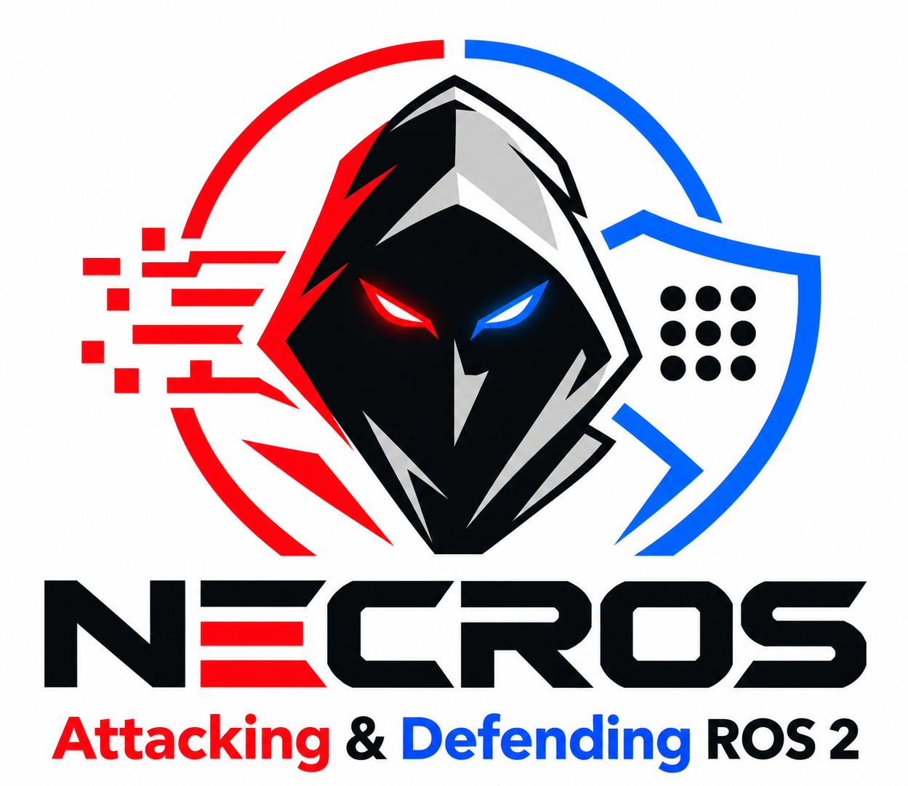
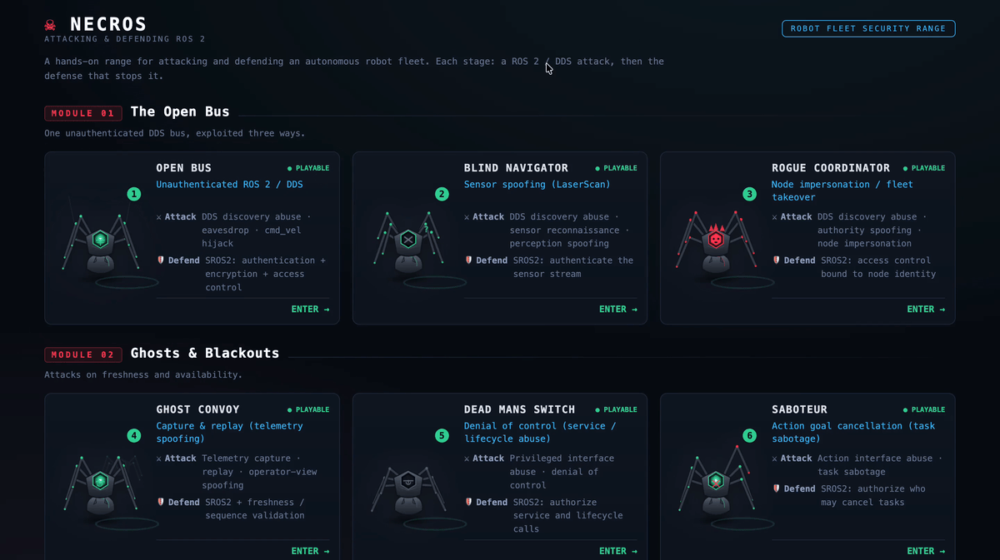

<p align="center">
  
</p>

<p align="center">
  A hands-on cyber range for attacking and defending an autonomous robot fleet over ROS 2.
</p>

<p align="center">
  
  
  
  
  
  
</p>

## 🎬 Demo

<p align="center">
  
</p>

---

## 💀 Why this exists

ROS 2 (the Robot Operating System 2) is the dominant framework for modern robots:
warehouse fleets, delivery robots, inspection drones, autonomous vehicles. It is a genuine
improvement over ROS 1 because it can be secured. But it ships insecure by default, and
most deployments run that way. On a
default ROS 2 system, anyone who can reach the network can discover every robot, read its
sensors, drive its motors, impersonate its controller, or switch it off.

- **Almost nobody turns security on.** It ships off, and real fleets run exposed in
  production. Being able to demonstrate the exposure is what gets a team to fix it. The
  attack is the business case for the defense.
- **You cannot defend what you cannot see.** A correct access policy has to name every
  topic, service, lifecycle transition, and action a robot uses. Miss one and the robot
  fails to start. Enumerating the system like an attacker is how you build that policy
  correctly.
- **SROS 2 (Secure ROS 2) is not always enough.** One scenario here is a replay attack:
  the attacker captures the robot's own genuine, signed telemetry and plays it back. Every
  packet is authentic, so authentication and encryption pass it straight through.
  Stopping it takes a second layer, freshness validation, that SROS 2 alone does not give
  you.

---

## 🎯 Scenarios

Each scenario is an isolated robot world on its own DDS (Data Distribution Service)
domain, with a 3D console and a guided mission.

| # | Scenario | Attack class | What you do | Defense |
|---|----------|--------------|-------------|---------|
| 1 | **Open Bus** | Command injection | Discover the fleet, eavesdrop on a robot, hijack its motors | SROS 2 authentication + encryption + access control |
| 2 | **Blind Navigator** | Sensor spoofing | Feed a robot a fake sensor view so it crashes itself | Authenticate the sensor stream |
| 3 | **Rogue Coordinator** | Node impersonation | Pose as the fleet's controller and command every robot | Bind command authority to a verified identity |
| 4 | **Ghost Convoy** | Replay / freshness | Replay a robot's own real telemetry to freeze the operator's view | SROS 2 **+** freshness / sequence validation |
| 5 | **Dead Man's Switch** | Denial of control | Switch a healthy robot off through its own control interfaces | Authorize who may call service and lifecycle commands |
| 6 | **Saboteur** | Task sabotage | Abort a robot's missions over and over through its action interface | Authorize who may cancel tasks |

---

## 🚀 Getting Started

**Requirements:** Docker Desktop (or Docker Engine with Compose v2).

```bash
git clone https://github.com/Khartheesvar/NECROS.git
cd NECROS
docker compose up -d
```

Then open the operator console:

```
http://localhost:3000
```

The fleet is already patrolling and the console is live. Pick a scenario from the console
and read its mission. For each scenario, you can follow the walkthrough in
[`solutions/`](solutions/).

---

## ⚔️ Attack

You launch every attack from one place: the `attacker` machine, a Kali box with the
standard `ros2` command-line tools. Open a shell on it and set the domain to the scenario
number:

```bash
docker compose exec attacker bash
export ROS_DOMAIN_ID=1        # the domain number matches the scenario number
```

From here you discover, eavesdrop on, and act against the fleet. Watch the 3D console
react as you do.

---

## 🛡️ Defend

Each scenario's robot runs in its own container, named so it maps to the scenario at a
glance: `s1-fleet`, `s2-dock`, `s3-takeover`, `s4-convoy`, `s5-sentinel`, `s6-saboteur`.
You defend a scenario by opening a shell on its container and hardening the robot there.
For most scenarios that means provisioning SROS 2; a few need an extra layer on top, which
their walkthrough covers.

```bash
docker compose exec s1-fleet bash   # swap in the container for your scenario
```

Inside, you create the security identities, enforce the access policy, and restart the
robot secured.

---

## 📄 License

This program is free software: you can redistribute it and/or modify it under the terms of
the MIT License.

---

<p align="center"><sub>ROS 2 Jazzy · DDS · SROS 2 · built for hands-on robot security training</sub></p>
